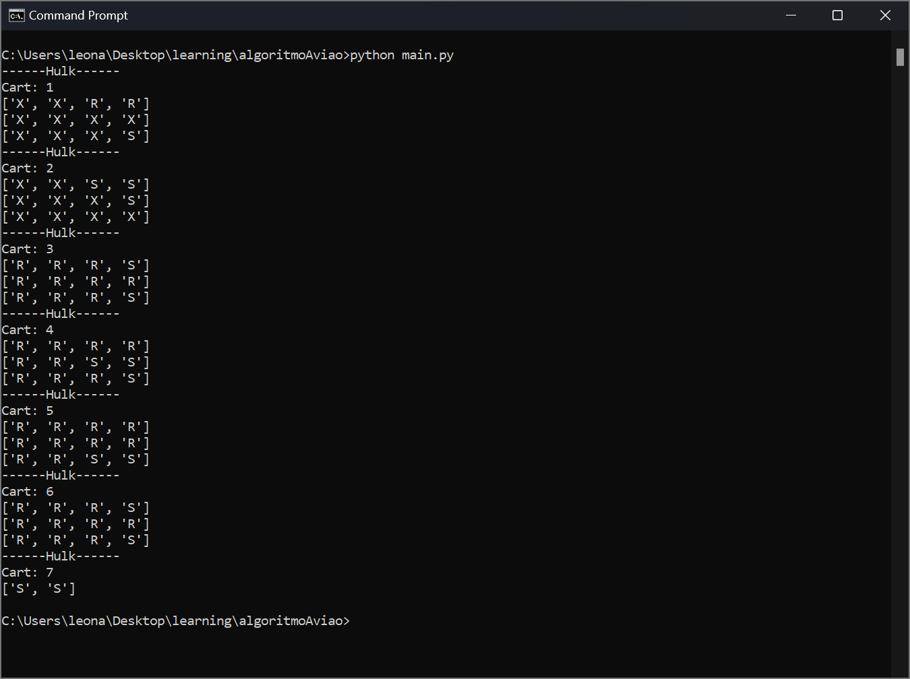

# Universal Line Manager

<!-- Alterar cover quando o projeto estiver 100% funcional -->

> Manages lines of people on attractions in the Universal Park

The Universal Park has a system of lines that consists of three different groups: the **Express**, which is made of guests who paid an extra money and have **priority** in almost every attraction; the **Regular**, which consists of people who didn't buy the Express pass; and the **Single Rider** line, which allows people to, usually, go faster in an attraction with the downside of being split of their parties, they are basically **used to fill empty spaces**. These lines are commanded by one person that keeps telling people in which row of the attraction they sould go. **This script**, following some business rules, **finds a way to automate this proccess**

## 💻 Tech used

Foram usadas quatro tecnologias:

- [Python](https://www.embarcadero.com/br/products/rad-studio): a very good programming language
- [VS Code](https://code.visualstudio.com/): a lightweight enhanced text editor
- [🧠Brain](https://www.google.com/search?q=brain&rlz=1C1VDKB_enUS1001US1001&oq=brain&aqs=chrome..69i57j0i512l7j46i199i465i512.939j0j4&sourceid=chrome&ie=UTF-8): a complex organ that controls thought, memory...

## ☕ Using the Universal Line Manager

To change the lines you only have to change the file `Lines.txt`, located in the `Attractions` folder. You can also create more attractions by adding more lines to the `attractions.txt` following the `pattern.txt` file, both also located in the `Attractions` folder. Then, you can run the `main.py` in the cmd py typing `python main.py` in the root folder.

## 📫 Contributing to the Universal Line Manager

> Your contribution is very welcome! 😀

> Ideas are shown in the issues tab

### To contribute to the Universal Line Manager, follow these steps:

1. Fork this repository.
2. Create a branch: `git checkout -b <branch_name>`.
3. Modify, save and then commit: `git commit -m '<commit_message>'`
4. Push to the origin branch: `git push origin UniversalLineManager / <local>`
5. Create Pull Request.

### You can also create more [issues](https://github.com/LeoUpperThrower4/UniversalLineManager/issues) directly in Github to help map bugs e suggest new features!

As an alternative, check Github`s documentation on [how to create a pull request](https://help.github.com/en/github/collaborating-with-issues-and-pull-requests/creating-a-pull-request).

## 📝 License

This project is licensed under MIT.
